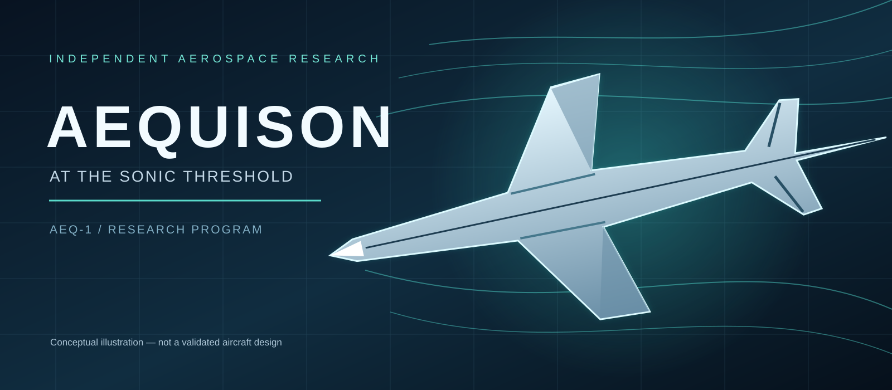
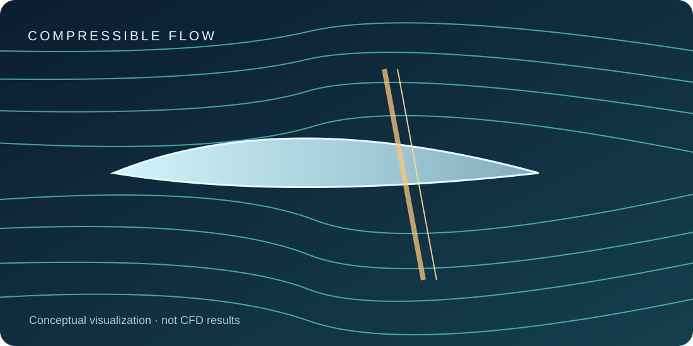
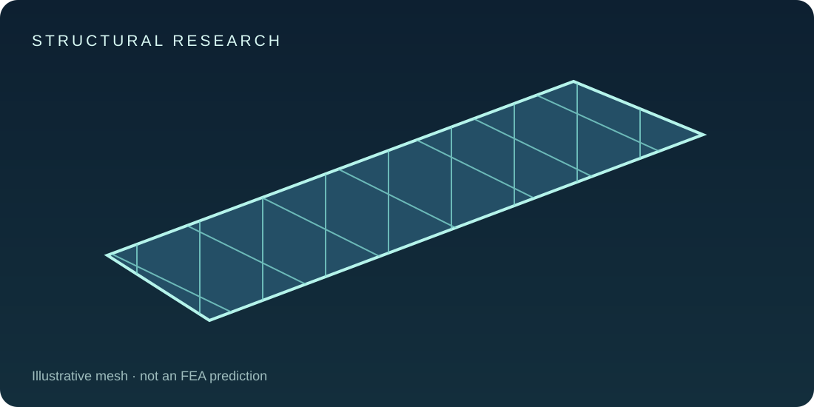
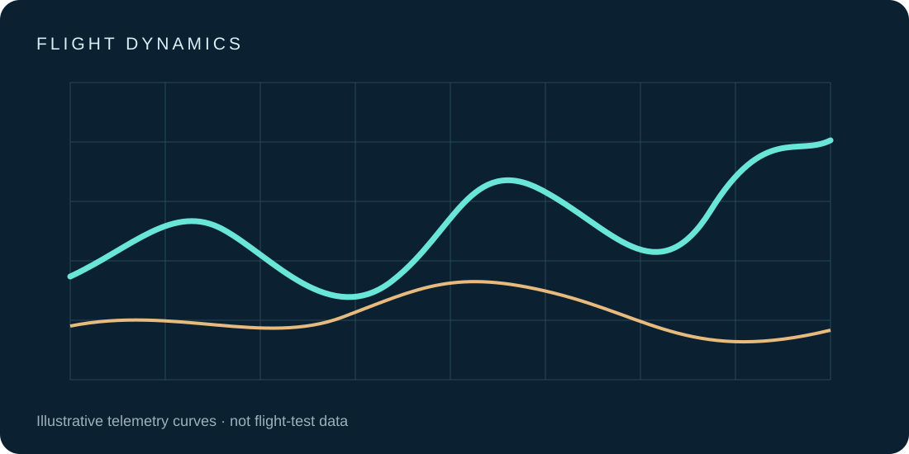

# AEQUISON
### AEQ-1 | Aerospace Research & Experimental Development

**Researching the sonic threshold through reproducible engineering analysis.**

AEQUISON is an independent team-based aerospace research and experimental development initiative investigating transonic aerodynamics, structural behavior, flight physics, simulation verification, and staged laboratory and subsonic demonstration methods. A separate competition track evaluates possible participation in the [Boom Prize](https://boomsupersonic.com/prize).

**Status:** Research and development planning. No Mach 1 capability, competition qualification, or supersonic flight authorization has been demonstrated.

## Project navigation
- [Research program](docs/RESEARCH.md)
- **[AEQ-AER-001 — Transonic Aerodynamics Literature Review](docs/research/AEQ-AER-001-Transonic-Aerodynamics-Literature-Review.md)** *(Rev 0.1, draft; independent review pending)*
- [Development lifecycle and engineering gates](docs/DEVELOPMENT.md)
- [Subsystem research index](docs/SUBSYSTEMS.md)
- [Development and experiment log](docs/BUILD_LOG.md)
- [Verification and validation framework](docs/VERIFICATION.md)
- [Graduate research, competition and future commercial pathways](docs/ACADEMIC_AND_IP.md)
- [Research report template](docs/templates/RESEARCH_REPORT.md)
- [Experiment record template](docs/templates/EXPERIMENT_RECORD.md)
- [Competition compliance](docs/COMPETITION.md)
- [Research roadmap](docs/ROADMAP.md)
- [Documentation and revision control](docs/DOCUMENT_CONTROL.md)
- [Safety and testing scope](docs/SAFETY.md)
- [Contributing to AEQUISON](CONTRIBUTING.md)
- [Project website source](index.html)

## Research workstreams

| Aerodynamic research | Structures and materials | Flight dynamics |
| --- | --- | --- |
|  |  |  |

*Original conceptual illustrations; none depict verified AEQUISON aircraft, CFD, FEA, or flight-test results.*

1. Atmosphere and aerodynamic modeling, including public transonic experimental benchmarks
2. Wing architecture literature studies, including the costs of variable sweep
3. Structural and materials research
4. Flight simulation and data integrity for low-speed demonstrators
5. Propulsion technology literature assessment
6. Regulatory feasibility and competition compliance

## Research-to-development workflow

**Requirements → Literature research → Numerical modeling → Independent verification → Reviewed laboratory studies → Separately authorized subsonic demonstrations → Technical reports.**

This repository publishes the methods, status and approved evidence for each stage. The [development log](docs/BUILD_LOG.md) captures activity and changes as they occur, including unsuccessful investigations. Actual high-speed aircraft construction or supersonic tests are not planned or authorized by these documents.

### Academic and commercial relevance
AEQUISON is being organized as potential graduate-level research, with a separate Boom Prize track and future possible commercial applications. University ownership, team contributions and competition rules require their own review before work is shared across those tracks. See [academic and IP policy](docs/ACADEMIC_AND_IP.md).

## Existing team infrastructure
SolidWorks, Autodesk Inventor, MATLAB, ANSYS Mechanical (partner access and usage permission to verify), engineering workstation and TrueNAS storage. Additional open-source tools may include OpenVSP, SU2, ParaView, Git and Python.

## Status board
| Phase | Status |
| --- | --- |
| Project name and team | Established |
| Requirements/documentation framework | Draft; public templates established |
| Research and development log | Created; no physical build entries yet |
| Subsystem documentation structure | Created; studies planned |
| Official competition rules verification | In progress |
| MATLAB atmospheric validation | Planned |
| Published CFD benchmark reproduction | Planned |
| Fixed vs. variable-sweep literature review | Planned |
| Aircraft flight-test authorization | Not established |

## Publishing policy
Only reviewer-approved, non-sensitive research summaries belong in this public repository. Private team records, budgets, controlled engineering files, access credentials and unapproved findings belong in a separately permissioned internal workspace.

AEQUISON is independent and not endorsed by Boom Supersonic. Competition rules and legal requirements are controlled by their respective authorities.

© 2026 AEQUISON contributors. Rights reserved pending a team-approved license.
